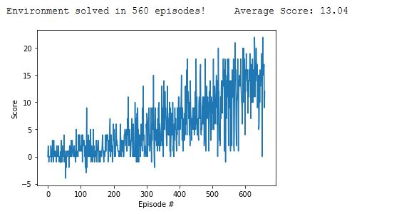

[//]: # (Image References)

[image1]: https://user-images.githubusercontent.com/10624937/42135619-d90f2f28-7d12-11e8-8823-82b970a54d7e.gif "Trained Agent"

# Project 1: Navigation Report

![Trained Agent][image1]

# Implementation:
In order to solve the first project an implementation of a neural network with the help of model.py and an implementation of an agent with a replay 
buffer with the help of dqn_agent.py has been done.
The code is clearly documented for further information about the implementation itself

The neural network itself has:

	- one input layer with the size 37 (representation of the state space)
	- three hidden layers with the size 200, 100 and 20 and 
	- one output layer with the size 4 (representation of the action space)
	
The agent creates one target neural network and one local neural network based on the QNetwork class inside model.py
The agent has three main functions:

	***def act(self, state, epsilon):***
		Functionality to determine the action in the current state. As epsilon decays over time, we´re starting with
        lot´s of random actions that get more less over time and the estimated action of the network will be taken
        :param state: Current state of the environment
        :param epsilon: Value to slowly change from random sampling to greedy polica
        :return: The action to take in the environment
	
	***def step(self, state, action, reward, next_state):***
		Get´s the information about the state of the environment, and stores it in the memory.
        Additionaly the function determines, if a learning steps needs to be taken or not

        Params:
        ======
            state: Current State of the environment
            action: The action taken in the current state
            reward: The reward that has been granted by taking the action in the current state
            next_state: The next state reached by taking the action in the previous state
			
	***def learn(self, experiences, gamma):***        
        The learning function of the agent. Here the TD - error fort the complete batch will be calculated. Afterwards
        the mean squared error will be calculated to do a backpropagation through the neural network.
        At the end the weights of the target network will be adjusted
        :param experiences: a sample of experiences from the replay memory with the size BATCH_SIZE
        :param gamma: Discount rate for future rewards
 
Additionaly a replay buffer class has been implemented in order to store state, acteion, reward, next state tuples in this buffer, in order to be able to learn from it
The replay buffer has two main functions:
	
	***add(self, state, action, reward, next_state):***
        Adding a new state, action, reward, next_state tuple to the replay memory
        :param state: Current state
        :param action: Action taken in current stat
        :param reward: Reward that has been granted
        :param next_state: Next state reached
        :return:
		
	***def sample(self):***
        '''
        Extracting a set of states, actions, rewards, next states by the size of the batch size from the replay buffer
        :return: Return the states, actions, rewards, next_states (size = batch_size)
		
# Learning algorithm
As a learning algorithm a double DQN with a replay buffer has been choosen.
This means there is a target DQN in order to calculate the TD target and a local DQN to calculate the actual Q-value.
Based on this two the TD - error will be calculated in order to retreive the mean squared error loss which is the input to the backpropagation
to adjust the weights of the local DQN accordingly.
The target DQN will be adapted slowly to not diverge to much from the local DQN

In order to brake the correlation between state, action and the resulting next state a replay buffer has been introduced. 
With the replay buffer, a random sample fo state, action, reward, next state batch will be retreived after a certain amount of time and the agent
will be trained on that random sample

In order to train the agen the following hyperparameter has been chosen:

alpha = 0.0005
gamma = 0.99
tau = 0.001
epsilon = 1.0 with epsion_decay=0.992 and epsilon_min = 0.01

Hyperparameters for replay buffer:

buffer size = 1e5
batch_size = 100
update_every = 10

